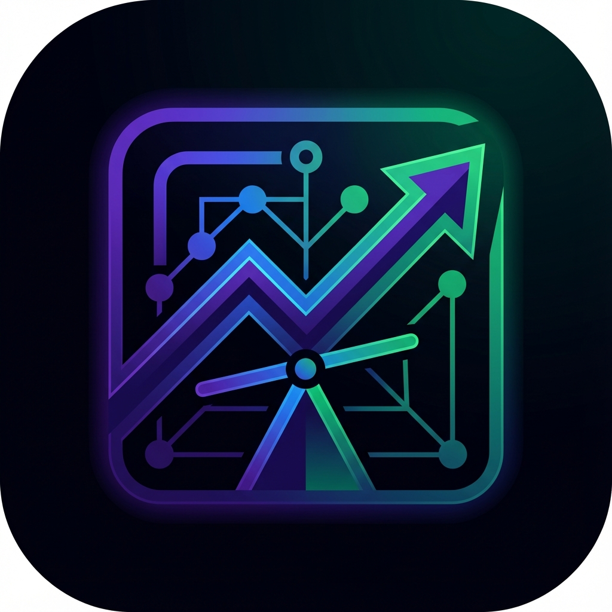

# EconoSim



> **Visualize the Hidden Math of Everyday Decisions.**

EconoSim is an advanced interactive simulator designed to reveal the invisible economic forces shaping your financial reality. From the compounding cost of food delivery to the long-term wealth erosion of high-interest installments, EconoSim transforms abstract economic principles into concrete, navigable data.

## 🎯 Mission

Most financial mistakes happen because humans aren't wired to calculate opportunity cost, compound interest, and risk premiums in real-time. EconoSim bridges this gap by providing a sandbox where users can tweak variables and instantly see the short-term vs. long-term impact of their choices.

## ✨ Key Features

- **Dynamic Economic Engine**: Real-time calculations for compound interest, loan optimizations, and opportunity cost analysis.
- **Scenario Modeling**:
  - 📱 **Phone Purchase Strategy**: Upfront vs. Installment trade-offs.
  - 🛵 **The Delivery Dilemma**: The true cost of convenience over time.
  - 🛡️ **Safety Net Calibration**: Emergency fund liquidity vs. market exposure.
  - 📈 **Macro Policy**: Minimum wage elasticity impacts.
  - 🎓 **Education ROI**: Student loan leverage vs. workforce entry.
- **Premium Experience**:
  - Immersive dark-mode aesthetics with glassmorphism.
  - Fluid animations powered by Framer Motion.
  - Responsive, touch-ready design.

## 🛠 Tech Stack

Built with a focus on performance, type safety, and modern design patterns.

- **Framework**: [Next.js 15](https://nextjs.org/) (App Router)
- **Language**: TypeScript
- **Styling**: [Tailwind CSS v4](https://tailwindcss.com/)
- **Animation**: [Framer Motion](https://www.framer.com/motion/)
- **Icons**: [Lucide React](https://lucide.dev/)
- **Fonts**: [Outfit](https://fonts.google.com/specimen/Outfit)

## 🚀 Getting Started

### Prerequisites

- Node.js 18.17 or later
- npm or yarn

### Installation

1.  **Clone the repository**

    ```bash
    git clone https://github.com/yourusername/econosim.git
    cd econosim
    ```

2.  **Install dependencies**

    ```bash
    npm install
    ```

3.  **Run the development server**

    ```bash
    npm run dev
    ```

4.  Open [http://localhost:3000](http://localhost:3000) (or the port shown in your terminal) to view the application.

## 📂 Project Structure

```bash
src/
├── app/
│   ├── globals.css      # Design system & glassmorphism utilities
│   ├── layout.tsx       # Root layout & SEO metadata
│   ├── page.tsx         # Main simulation engine & UI components
│   ├── icon.png         # App Favicon
│   └── opengraph-image.png # Social Media Preview
public/
│   └── logo.png         # Brand Assets
```

## 🤝 Contributing

We welcome contributions! Please see our [Contributing Guidelines](CONTRIBUTING.md) for more details.

1.  Fork the Project
2.  Create your Feature Branch (`git checkout -b feature/AmazingFeature`)
3.  Commit your Changes (`git commit -m 'Add some AmazingFeature'`)
4.  Push to the Branch (`git push origin feature/AmazingFeature`)
5.  Open a Pull Request

## 📄 License

Distributed under the MIT License. See `LICENSE` for more information.

---

<p align="center">
  Built with ❤️ by the <strong>EconoSim Intelligence Lab</strong>
</p>
